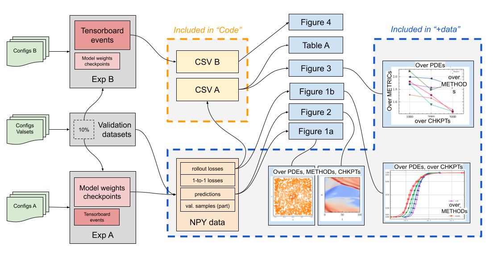

# Supplementary Materials Instructions


In order to follow Open Science principles, we want to give the code, the experiments and its assets in as complete as possible form. 
However, to respect the double-blind review process, we have to anonymise everything.

We fully anonymised the codebase itself, i.e., the algorithm code, scripts that create all configuration files, scripts that run the experiments, scripts that process the results of the experiments and create the plots that are included in the paper.
Conducted and presented in the paper experiments can be reproduced almost exactly* with these scripts, although, it can take up to ~150 compute hours (80% GPU hours) and ~30+ GB storage.
We understand it is an immense effort, even more, it is an additional carbon footprint of computational research.
Therefore, we want to include all our experimental assets. 

However, we have to anonymise it too, i.e., exclude any paths, usernames, mention of clusters/supercomputers names that can reveal our identities or/and affiliations. 
This would incur replacing these in our experimental codespace with `XXX`, which can be considered as manipulation of the artifacts ("if I changed XXX to YYY, I could change WWW to ZZZ too").

In addition, some experimental assets are heavy files but do not incur anonymisation.

To find a good middle-ground solution, we come up with the following system. It is left to the reviewers' decision which option suits them better.


|Level| Includes| Produces| Source |
|---        |---|---|---|
| **Code** | <ul><li>Algorithms codes</li><li>Experiments codes</li><li>Scripts "end-to-end": <ul><li>generating config. files</li><li>running experiments</li><li>processing exp. results</li><li>creating plots</li></ul></li><li>Part of results files:<ul> <li>combined `.csv` A, B</li></ul></li></ul>  | <ul><li>Table A statistics <ul><li>for checkpoints 1k, 2k, **3k**, 4k</li></ul></li><li>Figure 3<ul><li>for all PDE cases</li><li>**rollout** and other metrics from Table A</li></ul></li><li>Figure 4</li></ul> Can produce the same configs used for ExpA and ExpB, and to create validation datasets.| **This repository.** <br> Code: <ul><li>[Common](./common/README.md)</li><li>[Scripts](./scripts/README.md)</li></ul> Data and plotting: <ul><li>Main experiments (ExpA): [combined `.csv`](./validation_results/validation_results_decay/combined_validation_results.csv)</li><li>Random seed experiments (ExpB): [combined `.csv`](./validation_results/random_seed_tensorboard_results.csv)</li><li>Plotting these results: [ipynb](./validation_results/csv_to_tab_plot.ipynb)</li></ul>  Fork of Melissa with the algorithm: [url](url |
|**+data**  |  For ExpA, per PDE, per method, per model checkpoint: <ul><li>`.npy` data for plots</li><li>`.csv` metrics</li><li>`.pdf` plots</li></ul> |  Combined `.csv` , and for any PDE/method, available chkpt:<ul><li>Figure 1ab</li><li>Figure 2</li></ul>   | Download [here](url (1.1GB) and unzip into `validation_results` directory |
|**+models, +valset**  |  For ExpA, per PDE, per method: <ul><li>model weights chkpt every 1k iterations</li></ul> Full validation datasets for all PDEs| <ul><li>`.npy` data for plots</li><li>`.csv` metrics</li><li>`.pdf` plots</li></ul> | Download chkpts [here](url and unzip[^1] into `experiments` directory, can be combined with level "+tensorboard". <br> Download val. datasets [here](url (~30GB). |
|**+tensorboard**  |  For ExpB, per PDE, per method:<ul><li>`tensorboard` event file</li></ul> | <ul><li> ExpB combined `.csv` B</li><li> can see all other statistics, e.g., training loss  | Download [here](url , unzip[^1] into `experiments` directory, can be combined with level "+models" |
|**Fullest**  |  Copy of the whole workspace. <br> All configs, logs, Melissa scripts (<span style="color:red">not anonymised</span>), and as well data, model chkpts, tensorboards, .... |   | Download [here](url, the archive already contains everything from the previous levels. |
|**Semi**  |  Level "Code" + anonymised configs (view only)|    | See here:  |


1*: The right way to unzip the archive to preserve directories structure: `unzip TODO`



METRICs (calculated over the full validation dataset):
- full rollout nRMSE average,
- one-to-one MSE mean, max, std, median.

METHODs: broad, precise, mixed, soft, uniform, static

PDEs: see [table](scripts/utils/pde_set.csv)

CHKPTs: model weights checkpoints available, usually 1k-2k-3k--4k


## Container Usage Instructions

## Installation Instructions

### Local Melissa and JAX/APEBench with `conda` for GPU

Before installing, make sure `LD_LIBRARY_PATH` is not set.

There is a `jax[cuda12]`, which should install its own cuda toolkit and cuDNN version from Python wheels.
```bash
conda create -n apebench python=3.10
conda activate apebench
python3 -m pip install --upgrade pip
python3 -m pip install --upgrade "jax[cuda12]"
python3 -m pip install apebench
```

If this does not work, add `cuda cudnn` to `conda create` and let `jax` installation use local versions, like this:

```bash
conda create -n apebench python=3.10 cuda cudnn
conda activate apebench
python3 -m pip install --upgrade pip
python3 -m pip install --upgrade "jax[cuda12_local]"
python3 -m pip install apebench
```

To check that GPU is available:
```bash
(apebench) user@user:~/path/to/repo$ python3
Python 3.10.16 (main, XXX XX 202X, XX:XX:XX) [GCC 11.2.0] on linux
Type "help", "copyright", "credits" or "license" for more information.
>>> import jax
>>> jax.devices()
[CudaDevice(id=0)]
```

Set `XLA_FLAGS` for CUDA library search path to find `nvvm/libdevices.so`,
```bash
export XLA_FLAGS="--xla_gpu_cuda_data_dir=$CONDA_PREFIX"
```

<!-- Finally, try a toy training with apebench,
```bash
python3 sample/hello.py
``` -->

_Note: Melissa installation within the local conda environment has been complicated. Only testing apebench x melissa on jean-zay at the moment._

### Melissa and JAX/APEBench with `module` for GPU

#### JAX/APEBench

```bash
module load python/3.10.4 cudnn/9.2.0.82-cuda
python3 -m pip install --user --no-cache-dir "jax[cuda12_local]"
python3 -m pip install --user --no-cache-dir apebench
```
_When running_
```bash
module load python/3.10.4 cudnn/9.2.0.82-cuda
python3 sample/hello.py
```
TODO: i deleted sample/hello.py should return it back lol

#### Melissa
```bash
module load cmake zeromq openmpi/4.1.5 python/3.10.4 cudnn/9.2.0.82-cuda
git clone https://gitlab.inria.fr/melissa/melissa.git MELISSA
cd MELISSA
python3 -m pip install --target=install --no-deps --no-cache-dir -e .[dl]
cmake -DCMAKE_INSTALL_PREFIX=install -DINSTALL_ZMQ=OFF -S . -B build
make -C build
make -C build install
```

_Note: Install unfound packages with `python3 -m pip install --user --no-cache-dir ...` in `~/.local`_


